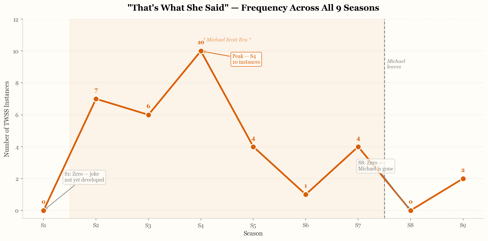
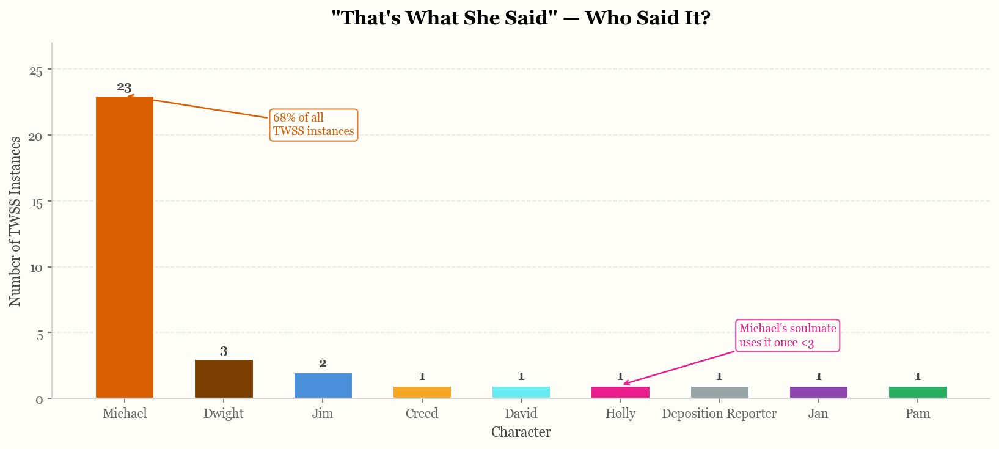
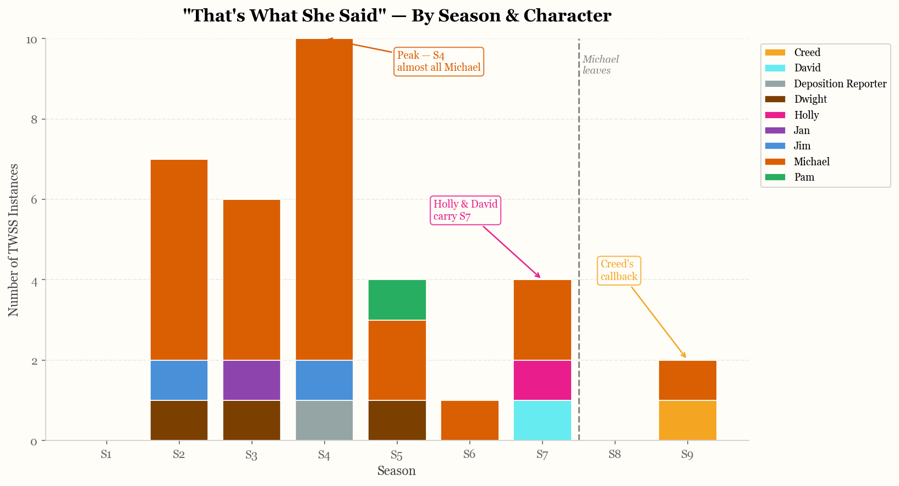
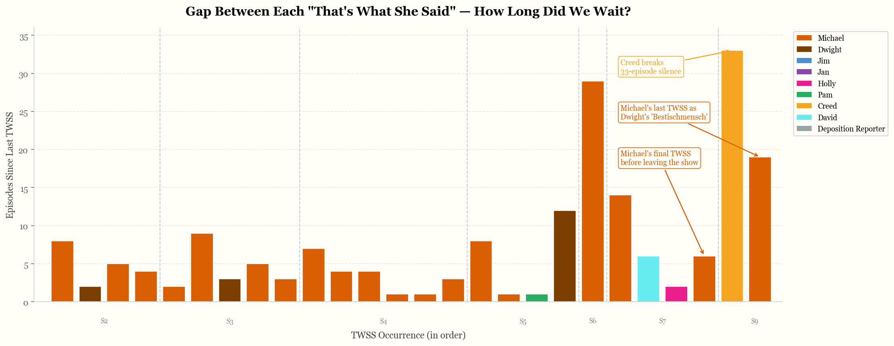
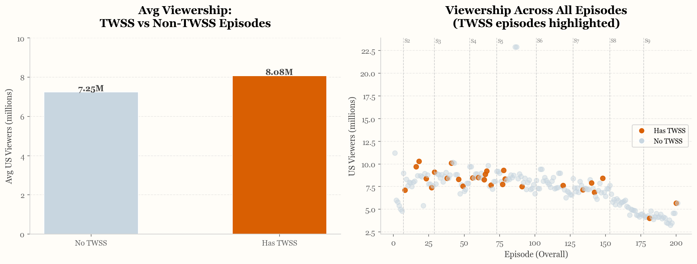

# 📺 "That's What She Said" — A Data Analysis of The Office

> *"That's what she said."* — Michael Scott, approximately 23 times across 9 seasons.

This project analyses every instance of the iconic "That's What She Said" joke across all 9 seasons of The Office (US), exploring how the joke evolved over time, who said it, and what happened to it after Michael Scott left the show.

Built as a portfolio project for the Google Professional Data Analytics Certificate using Python, Pandas, Matplotlib and Seaborn.

---

## 📌 Project Overview

The "That's What She Said" joke is one of the most recognisable running gags in TV history — but how often did it actually appear? Did it peak early or late? Who else picked it up? And did it die with Michael?

This analysis answers all of those questions using 54,626 lines of dialogue across 201 episodes.

---

## 📊 Key Findings

| Finding | Detail |
|---|---|
| **Total instances** | 34 confirmed TWSS across the whole series |
| **Peak season** | Season 4 with 10 instances |
| **Michael's share** | 23 out of 34 (68%) |
| **Season 1 & 8** | Zero instances — S1 predates the joke, S8 reflects Michael's absence |
| **Longest gap** | 33 episodes before Creed's callback in S9E5 |
| **Final line** | Michael's very last line in the series (S9E24) is a TWSS |

> The trajectory of "That's What She Said" is essentially a proxy for Michael Scott's presence in the show. It rises with his confidence, peaks at his most charismatic, fades as the show matures, and disappears entirely when he leaves — only returning as a fond callback in the finale.

---

## 📈 Visualisations

### Frequency by Season

### Who Said It?

### By Season & Character

### Gap Between Occurrences

### Viewership & TWSS

---

## 🗂️ Dataset Sources

| Dataset | Source |
|---|---|
| The Office Complete Dialogue Transcript | [Kaggle — nasirkhalid24](https://www.kaggle.com/datasets/nasirkhalid24/the-office-us-complete-dialoguetranscript) |
| The Office Episodes Data | [Kaggle — bcruise](https://www.kaggle.com/datasets/bcruise/the-office-episodes-data) |

---

## 🛠️ Tools & Libraries

- **Python** — Pandas, Matplotlib, Seaborn
- **Jupyter Notebook** — via VS Code

---

## 🚀 How to Run

1. Clone this repository
2. Download both datasets from Kaggle and place them in the project folder
3. Open `office-analysis.ipynb` in VS Code or Jupyter
4. Run All cells

---

*Part of my data analytics portfolio. Built with way too much love for The Office.*
